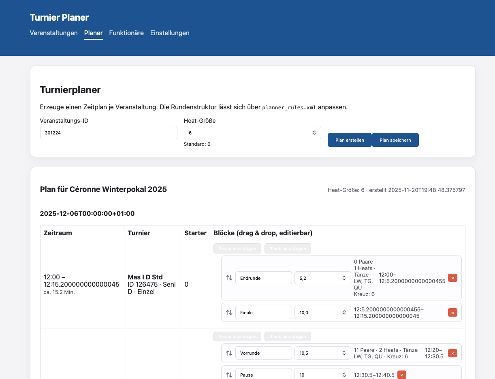
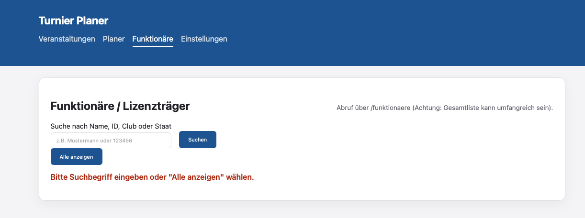

# Tanzturnierplaner

## Lokale Entwicklung starten

1. Virtuelle Umgebung anlegen und Abhängigkeiten installieren:

   ```bash
   python3 -m venv .venv
   source .venv/bin/activate
   pip install -r requirements.txt
   ```

2. Flask-App starten (wählt automatisch `templates/` und `static/` aus dem Projekt):

   ```bash
   flask --app app run
   # oder
   python main.py  # startet Server und öffnet automatisch den Browser
   ```

3. Im Browser `http://localhost:5000` (oder den im Terminal angezeigten Port) öffnen.


### Screenshot




### Roadmap

1. Löschfunktion für Zeitpläne
Gespeicherte Zeitpläne sollen gelöscht und umbenannt werden können.

2. User Management per UI
Pro User sollen individuelle Einstellungen möglich sein, etwa Rundenzeiten, Pausenzeiten oder die ESV-Zugangsdaten.

3. Automatischer Docker-Compose Build und Updates
Ein automatisierter Build und Update eines Docker-Stacks über GitHub Actions soll eingeführt werden.

4. Hosting des öffentliche und eine interne Zeitplans
Der Statische Zeitplan soll je eine eigene URL erhalten und gespeichert werden können.
Er soll in einem Iframe dargestellt werden können, um ihn in andere Websiten eingebunden werden zu können.

4. Upload-Funktion für Turniere
Turniere sollen wieder hochgeladen werden können, um Zeiten anzupassen.
Es wird nur die Turnier-ID mit den Zeiten hochgeladen!

5. Dynamischer Zeitplan aus der Turniersoftware
Der Zeitplan soll dynamisch Daten aus der Turniersoftware beziehen.
Verschiebungen sollen nachfolgende Turniere automatisch berücksichtigen und eine neue Berechnung der Runden, und Startzeiten durchgeführt werden.


6. Individuelle Endpoints für dynamische Ansichten
Pro Zeitplan sollen eigene Endpoints bereitgestellt werden, damit mehrere Live-Ansichten parallel im selben System möglich sind.